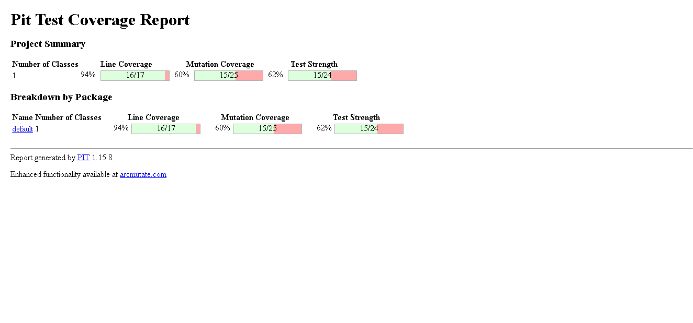
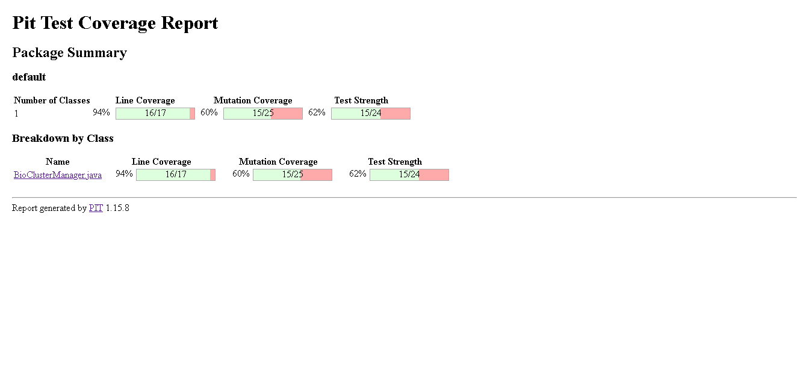
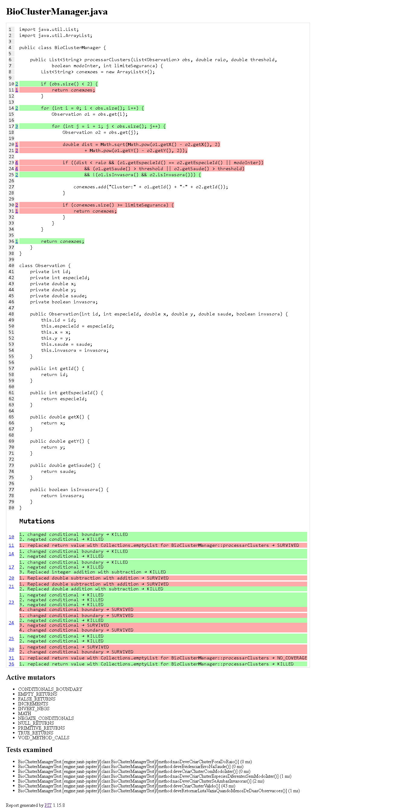

# 1. Introdução

Este relatório descreve a aplicação de técnicas de teste de software na função processarClusters. O objetivo principal foi empregar testes baseados em especificações, testes estruturais (MC/DC) e identificar possíveis falhas.

A função processarClusters examina uma série de dados biológicos e determina a formação de agrupamentos (clusters) com base em critérios como proximidade entre os dados, espécie, nível de saúde e classificação como invasoras.
      
---

# 2. Teste baseado em especificação

## 2.1 Classes de equivalência

| Parâmetro | Classe válida | Classe inválida |
|----------|--------------|----------------|
| Lista de observações | Pelo menos 2 elementos | Menos de 2 elementos |
| Distância | Menor que o raio | Maior ou igual ao raio |
| Espécie | Iguais ou modoInter = true | Diferentes com modoInter = false |
| Saúde | Pelo menos uma observação acima do threshold | Ambas abaixo ou iguais ao threshold |
| Invasora | Não serem ambas invasoras | Ambas invasoras |
| Limite de segurança | Não atingido | Atingido |

---

## 2.2 Casos de teste

Os casos de teste foram derivados das classes de equivalência definidas anteriormente.

| Caso | Descrição | Resultado esperado |
|------|----------|-------------------|
| CT01 | Lista com menos de 2 observações | Retorna lista vazia |
| CT02 | Observações próximas e mesma espécie | Cria cluster |
| CT03 | Observações fora do raio | Não cria cluster |
| CT04 | Espécies diferentes com modoInter falso | Não cria cluster |
| CT05 | Espécies diferentes com modoInter verdadeiro | Cria cluster |
| CT06 | Ambas invasoras | Não cria cluster |
| CT07 | Limite de segurança atingido | Interrompe execução |

---

# 3. Teste estrutural (MC/DC)

A condição principal para formação de um cluster pode ser representada pela expressão lógica:

A && (B || C) && (D || E) && !(F && G)

Cada condição foi alterada individualmente para verificar seu impacto no resultado final, conforme o critério MC/DC.
---

## 3.1 Definição das condições

| Condição | Significado |
|----------|------------|
| A | A distância entre as observações é menor que o raio definido |
| B | As observações pertencem à mesma espécie |
| C | O modo interespécie está ativado |
| D | A saúde da primeira observação (`o1`) é maior que o threshold |
| E | A saúde da segunda observação (`o2`) é maior que o threshold |
| F | A primeira observação (`o1`) é invasora |
| G | A segunda observação (`o2`) é invasora |

---

## 3.2 Tabela MC/DC

| Caso | A | B | C | D | E | F | G | Resultado |
|------|---|---|---|---|---|---|---|-----------|
| T1 | V | V | F | V | F | F | F | V |
| T2 | F | V | F | V | F | F | F | F |
| T3 | V | F | F | V | F | F | F | F |
| T4 | V | F | V | V | F | F | F | V |
| T5 | V | V | F | F | F | F | F | F |
| T6 | V | V | F | F | V | F | F | V |
| T7 | V | V | F | V | F | V | V | F |

---

# 4. Defeitos encontrados

Durante a análise foi identificado um erro na lógica de verificação do nível de saúde das observações durante a análise.

Código com defeito:

```java
(o1.getSaude() > threshold || o1.getSaude() > threshold)
```
Correção esperada:
```java
(o1.getSaude() > threshold || o2.getSaude() > threshold)
```
## 4.1 Impacto do erro

A implementação incorreta verifica duas vezes a saúde da primeira observação (`o1`) e ignora a saúde da segunda observação (`o2`).

Com isso, o sistema pode impedir a criação de clusters válidos quando apenas a segunda observação satisfaz o critério de saúde. Isso compromete a confiabilidade do sistema na formação correta de clusters.

---

# 5. Conjunto de testes (JUnit)
```java
import org.junit.jupiter.api.Test;
import java.util.List;
import static org.junit.jupiter.api.Assertions.*;

public class BioClusterManagerTest {

    private final BioClusterManager manager = new BioClusterManager();

    @Test
    void deveRetornarListaVaziaQuandoMenosDeDuasObservacoes() {
        List<Observation> obs = List.of(
            new Observation(1, 1, 0, 0, 90, false)
        );

        List<String> resultado = manager.processarClusters(obs, 10, 50, false, 10);

        assertTrue(resultado.isEmpty());
    }

    @Test
    void deveCriarClusterValido() {
        List<Observation> obs = List.of(
            new Observation(1, 1, 0, 0, 90, false),
            new Observation(2, 1, 3, 4, 80, false)
        );

        List<String> resultado = manager.processarClusters(obs, 10, 50, false, 10);

        assertEquals(List.of("Cluster:1-2"), resultado);
    }

    @Test
    void naoDeveCriarClusterForaDoRaio() {
        List<Observation> obs = List.of(
            new Observation(1, 1, 0, 0, 90, false),
            new Observation(2, 1, 20, 20, 80, false)
        );

        List<String> resultado = manager.processarClusters(obs, 10, 50, false, 10);

        assertTrue(resultado.isEmpty());
    }

    @Test
    void naoDeveCriarClusterEspeciesDiferentesSemModoInter() {
        List<Observation> obs = List.of(
            new Observation(1, 1, 0, 0, 90, false),
            new Observation(2, 2, 3, 4, 80, false)
        );

        List<String> resultado = manager.processarClusters(obs, 10, 50, false, 10);

        assertTrue(resultado.isEmpty());
    }

    @Test
    void deveCriarClusterComModoInter() {
        List<Observation> obs = List.of(
            new Observation(1, 1, 0, 0, 90, false),
            new Observation(2, 2, 3, 4, 80, false)
        );

        List<String> resultado = manager.processarClusters(obs, 10, 50, true, 10);

        assertEquals(List.of("Cluster:1-2"), resultado);
    }

    @Test
    void naoDeveCriarClusterSeAmbasInvasoras() {
        List<Observation> obs = List.of(
            new Observation(1, 1, 0, 0, 90, true),
            new Observation(2, 1, 3, 4, 80, true)
        );

        List<String> resultado = manager.processarClusters(obs, 10, 50, false, 10);

        assertTrue(resultado.isEmpty());
    }

    @Test
    void deveEvidenciarErroNaSaude() {
        List<Observation> obs = List.of(
            new Observation(1, 1, 0, 0, 40, false),
            new Observation(2, 1, 3, 4, 90, false)
        );

        List<String> resultado = manager.processarClusters(obs, 10, 50, false, 10);

        assertEquals(List.of("Cluster:1-2"), resultado);
    }
}

---
```
# 6. Conclusão

A aplicação das técnicas de teste permitiu validar o comportamento do método e identificar falhas relevantes na lógica implementada.

O principal defeito encontrado foi na verificação da saúde das observações, onde a implementação ignorava a segunda observação, podendo impedir a formação de clusters válidos.

O uso do critério MC/DC foi essencial para garantir uma cobertura adequada das combinações lógicas.

# 7. Resultado do PIT

A execução do teste de mutação utilizando PIT apresentou os seguintes resultados:

- Cobertura de linha: 94%
- Cobertura de mutação: 60%
- Força dos testes: 62%

O relatório mostrou que a maioria das linhas do sistema foi exercitada pelos testes automatizados. Entretanto, algumas mutações sobreviveram, indicando oportunidades de melhoria no conjunto de testes.

## 7.1 Resumo do relatório



---

## 7.2 Detalhamento das mutações



---

## 7.3 Cobertura por classe


Link da imagem no GitHub:
https://github.com/GabrielPdoCarmo/Teste-de-Software/tree/main/Prática%2001/img